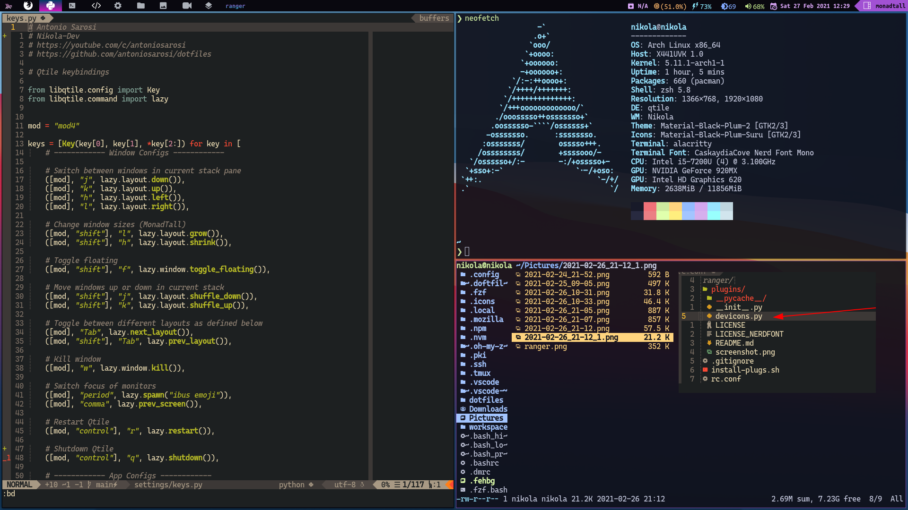

# Qtile



**_Idioma_**

- 🇪🇸 Español
- [🇺🇸 English](https://github.com/NikolaM-Dev/.doftfiles/tree/main/.config/qtile)

## Instalación

Instala Qtile y las dependencias:

```bash
sudo pacman -S qtile pacman-contrib
yay -S nerd-fonts-ubuntu-mono
```

Clona este repositorio y copia mis configuraciones:

```bash
git clone https://github.com/NikolaM-Dev/.dotfiles.git
cp -r .dotfiles/.config/qtile ~/.config
```

Pruébalo con **[Xephyr](https://wiki.archlinux.org/index.php/Xephyr)**:

```bash
Xephyr -br -ac -noreset -screen 1280x720 :1 &
DISPLAY=:1 qtile
```

Si el icono de la red no funciona, abre **./settings/widgets.py** y busca
esta línea, debería estar dentro de una lista llamada _primary_widgets_:

```python
# Cambia el argumento "interface", usa ip address para saber cuál poner
 widget.Net(**base(bg='color3'), interface='wlp2s0'),
```

Si en este punto aun sigue el error, debes revisar que este instalada la libreria **psutil** de python

```python
# para instalar la libreria ejecuta el comando
pip install psutil
```

Una vez eso está hecho, puedes iniciar sesión. Pero recuerda que los atajos de
teclado no funcionarán a no ser que tengas todos los programas que uso yo y las
mismas configuraciones. Puedes cambiar los atajos de teclado o bien instalar el
software que uso yo, mira
[esta sección](https://github.com/antoniosarosi/dotfiles/blob/master/README.es.md#atajos-de-teclado)
para las instrucciones.

## Estructura

En el archivo **config.py** que es donde la mayoría suele poner toda su
configuración, yo solo tengo el _autostart_ y algunas variables como
_cursor_warp_.

```python
@hook.subscribe.startup_once
def autostart():
    subprocess.call([path.join(qtile_path, 'autostart.sh')])
```

Para cambiar lo que se lanza en el _autostart_ abre el archivo
**./autostart.sh**.

```bash
#!/bin/sh

# systray battery icon
cbatticon -u 5 &
# systray volume
volumeicon &
```

Si quieres añadir o quitar atajos de teclado, abre **./settings/keys.py**. Para
añadir o quitar espacios de trabajos, debes modificar **./settings/groups.py**.
Finalmente, si quieres añadir nuevos _layouts_, abre **./settings/layouts.py**,
el resto de archivos no hace falta tocarlos.

## Temas

Para establecer un tema, mira los que hay disponibles en **./themes**, y coloca
su nombre en un archivo llamado **./config.json**, créalo si no lo tienes,
aunque de todos modos se creará de forma automática al iniciar Qtile:

```json
{ "theme": "big-sur" }
```
