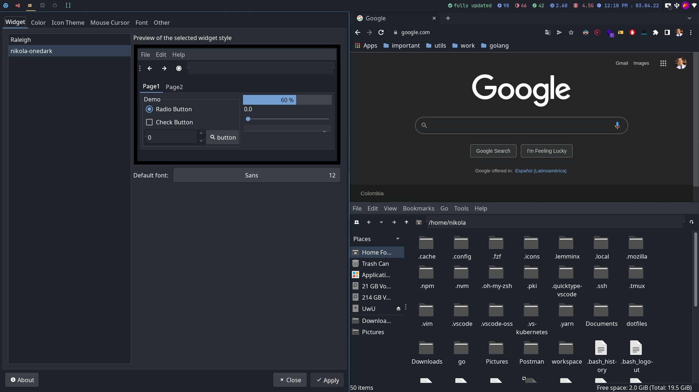

<h1 align=center>🎨 Nikola One Dark</h1>
<p align=center>
  A beautiful gtk theme based on the one dark color palette
</p>



## Install Theme

Move `nikola-onedark` to themes

```sh
sudo mv nikola-onedark /usr/share/themes
```

Now edit `~/.config/gtk-3.0/settings.ini` and add this:

```sh
# ~/.config/gtk-3.0/settings.ini
gtk-theme-name=nikola-onedark
```

<p align="center">⌨️ with ❤️ by <a href="https://github.com/NikolaM-Dev"><strong>NikolaM-Dev</strong><a></p>
