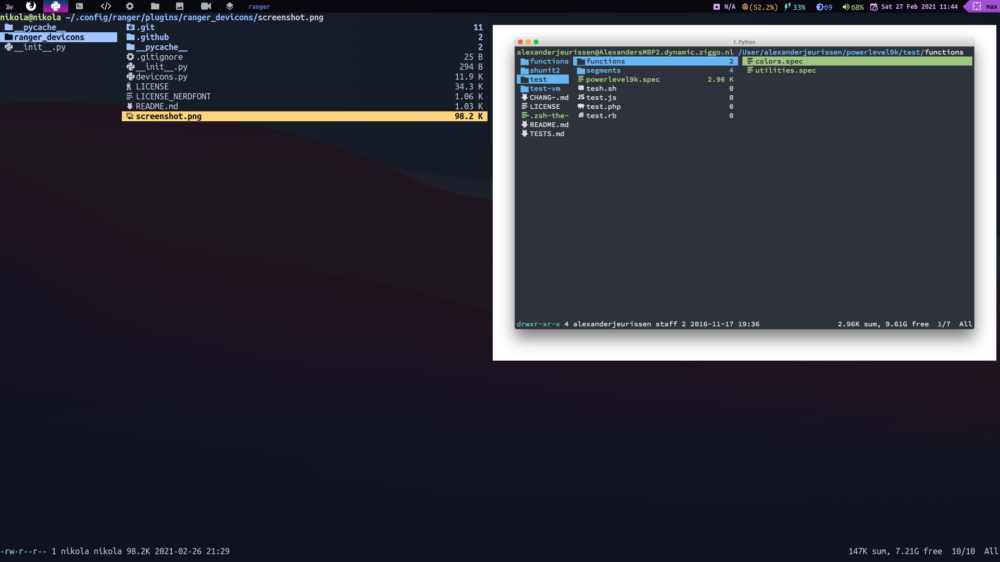

# Ranger



**_Idioma_**

- 🇪🇸 Español
- 🇺🇸 [English](https://github.com/NikolaM-Dev/.doftfiles/tree/main/.config/ranger)

## Instalacion de Ranger

```sh
sudo pacman -S ranger
```

## Copia mis configuraciones

```sh
git clone https://github.com/NikolaM-Dev/.doftfiles.git
cp -r dotfiles/.config/ranger ~/.config
```

## Instalacion de los Ranger Devicoins

```sh
`git clone https://github.com/alexanderjeurissen/ranger_devicons ~/.config/ranger/plugins/ranger_devicons`
echo "default_linemode devicons" >> $HOME/.config/ranger/rc.conf
```

## Instalacion de Ueberzug (solo linux)

Ueberzug es un previsualizador de imagenes y muchos mas...

```sh
pip install ueberzug
```
